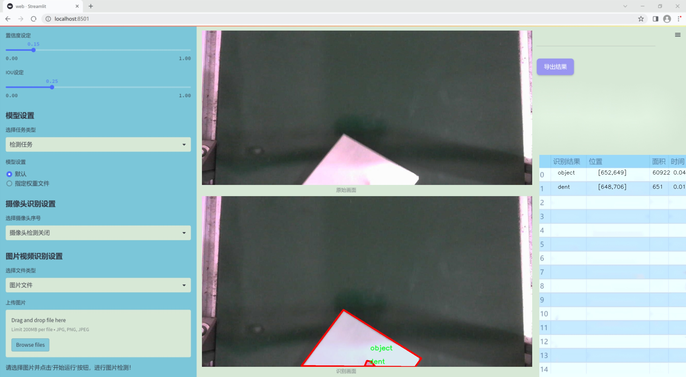
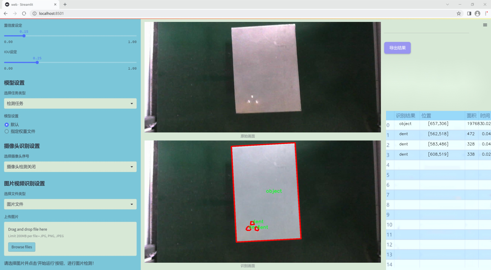
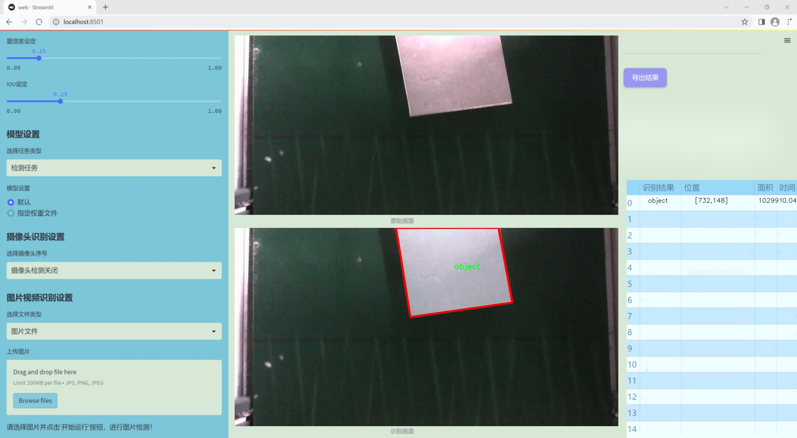
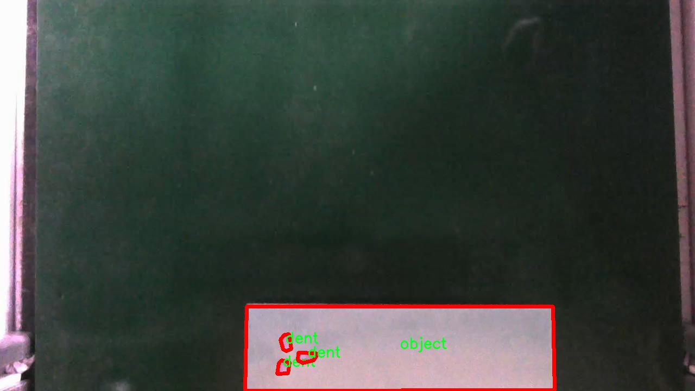
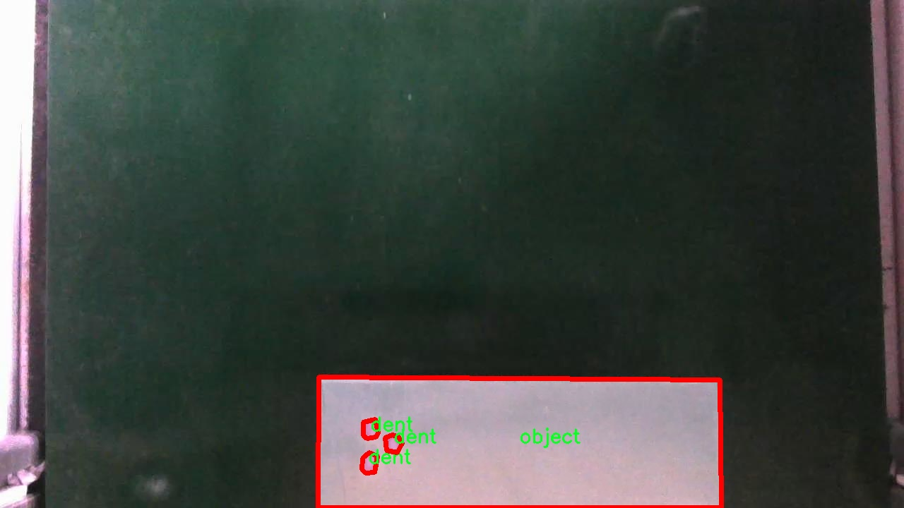
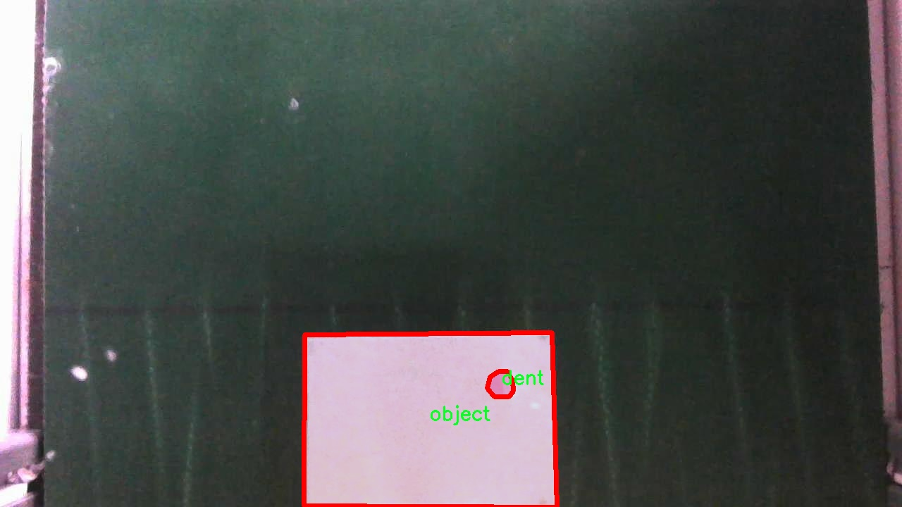
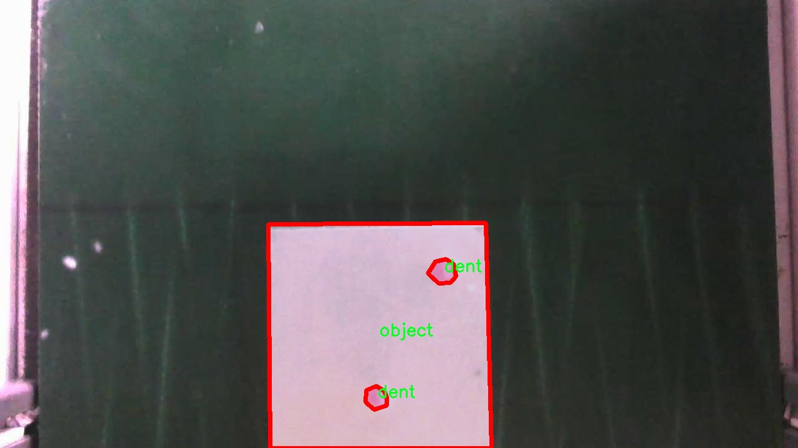
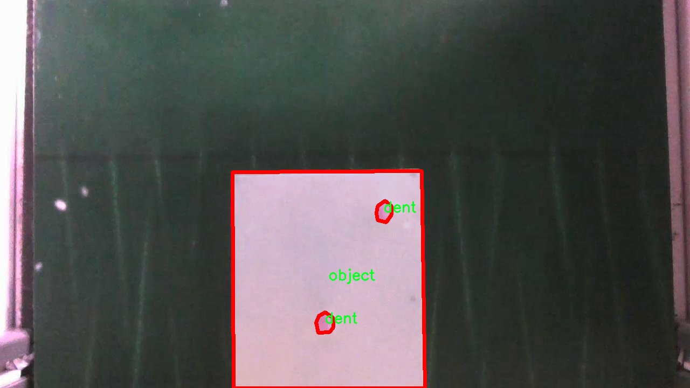

### 1.背景意义

研究背景与意义

随着工业自动化和智能制造的快速发展，缺陷检测技术在生产过程中扮演着越来越重要的角色。传统的人工检测方法不仅效率低下，而且容易受到人为因素的影响，导致漏检和误检的发生。因此，开发高效、准确的自动化缺陷检测系统成为了当前工业界和学术界的研究热点。近年来，深度学习技术的飞速进步为缺陷检测提供了新的解决方案，尤其是基于卷积神经网络（CNN）的目标检测算法，如YOLO（You Only Look Once）系列模型，因其在实时性和准确性方面的优越表现而备受关注。

本研究旨在基于改进的YOLOv11模型，构建一个高效的缺陷检测系统。该系统将应用于多种工业场景，能够实时识别和分类不同类型的缺陷，包括黑色标记、角落缺陷、凹陷、孔洞、物体、划痕和侧面缺陷等。通过使用包含1800张图像的多类别数据集，我们希望能够训练出一个具有较高鲁棒性和准确性的模型，以应对实际生产中的复杂情况。

此外，缺陷检测系统的成功实施不仅能够提高产品质量，降低生产成本，还能显著提升生产效率，减少人工干预，推动智能制造的进一步发展。因此，本研究不仅具有重要的理论意义，还有着广泛的应用前景。通过对YOLOv11模型的改进和优化，我们期望能够为缺陷检测领域提供新的思路和方法，为相关行业的智能化转型贡献力量。

### 2.视频效果

[2.1 视频效果](https://www.bilibili.com/video/BV1HxqqY3EaJ/)

### 3.图片效果







##### [项目涉及的源码数据来源链接](https://kdocs.cn/l/cszuIiCKVNis)**

注意：本项目提供训练的数据集和训练教程,由于版本持续更新,暂不提供权重文件（best.pt）,请按照6.训练教程进行训练后实现上图演示的效果。

### 4.数据集信息

##### 4.1 本项目数据集类别数＆类别名

nc: 7
names: ['black-marker', 'corner-defect', 'dent', 'hole', 'object', 'scratch', 'side-defect']


该项目为【图像分割】数据集，请在【训练教程和Web端加载模型教程（第三步）】这一步的时候按照【图像分割】部分的教程来训练

##### 4.2 本项目数据集信息介绍

本项目数据集信息介绍

本项目旨在通过改进YOLOv11模型，提升缺陷检测系统的性能。为此，我们构建了一个专门针对缺陷检测的高质量数据集。该数据集包含七个类别，分别为黑色标记、角落缺陷、凹陷、孔洞、物体、划痕和侧面缺陷。这些类别涵盖了在工业生产和质量控制中常见的多种缺陷类型，能够有效支持模型的训练与评估。

数据集的构建过程遵循严格的标准，确保每个类别的样本数量均衡且多样化，以便模型能够学习到不同缺陷的特征。黑色标记类别主要包括在产品表面上出现的色彩异常，角落缺陷则涉及到产品边缘的瑕疵。凹陷和孔洞类别则专注于物体表面的物理缺陷，反映了生产过程中的潜在问题。物体类别用于识别产品本身，而划痕和侧面缺陷则强调了表面损伤的不同形式。

数据集中每个类别的样本均经过精心标注，确保标注的准确性和一致性。这一过程不仅提高了数据集的质量，也为后续的模型训练提供了可靠的基础。通过使用该数据集，改进后的YOLOv11模型将能够更好地识别和分类不同类型的缺陷，从而在实际应用中实现更高的检测精度和效率。

总之，本项目的数据集不仅丰富多样，且具备良好的标注质量，为缺陷检测系统的研究和开发提供了坚实的基础。我们期待通过这一数据集的应用，推动缺陷检测技术的进步，为相关行业的质量控制提供有力支持。











### 5.全套项目环境部署视频教程（零基础手把手教学）

[5.1 所需软件PyCharm和Anaconda安装教程（第一步）](https://www.bilibili.com/video/BV1BoC1YCEKi/?spm_id_from=333.999.0.0&vd_source=bc9aec86d164b67a7004b996143742dc)


[5.2 安装Python虚拟环境创建和依赖库安装视频教程（第二步）](https://www.bilibili.com/video/BV1ZoC1YCEBw?spm_id_from=333.788.videopod.sections&vd_source=bc9aec86d164b67a7004b996143742dc)

### 6.改进YOLOv11训练教程和Web_UI前端加载模型教程（零基础手把手教学）

[6.1 改进YOLOv11训练教程和Web_UI前端加载模型教程（第三步）](https://www.bilibili.com/video/BV1BoC1YCEhR?spm_id_from=333.788.videopod.sections&vd_source=bc9aec86d164b67a7004b996143742dc)


按照上面的训练视频教程链接加载项目提供的数据集，运行train.py即可开始训练



     Epoch   gpu_mem       box       obj       cls    labels  img_size
     1/200     20.8G   0.01576   0.01955  0.007536        22      1280: 100%|██████████| 849/849 [14:42<00:00,  1.04s/it]
               Class     Images     Labels          P          R     mAP@.5 mAP@.5:.95: 100%|██████████| 213/213 [01:14<00:00,  2.87it/s]
                 all       3395      17314      0.994      0.957      0.0957      0.0843

     Epoch   gpu_mem       box       obj       cls    labels  img_size
     2/200     20.8G   0.01578   0.01923  0.007006        22      1280: 100%|██████████| 849/849 [14:44<00:00,  1.04s/it]
               Class     Images     Labels          P          R     mAP@.5 mAP@.5:.95: 100%|██████████| 213/213 [01:12<00:00,  2.95it/s]
                 all       3395      17314      0.996      0.956      0.0957      0.0845

     Epoch   gpu_mem       box       obj       cls    labels  img_size
     3/200     20.8G   0.01561    0.0191  0.006895        27      1280: 100%|██████████| 849/849 [10:56<00:00,  1.29it/s]
               Class     Images     Labels          P          R     mAP@.5 mAP@.5:.95: 100%|███████   | 187/213 [00:52<00:00,  4.04it/s]
                 all       3395      17314      0.996      0.957      0.0957      0.0845


###### [项目数据集下载链接](https://kdocs.cn/l/cszuIiCKVNis)

### 7.原始YOLOv11算法讲解


##### YOLOv11三大损失函数

YOLOv11（You Only Look Once）是一种流行的目标检测算法，其损失函数设计用于同时优化分类和定位任务。YOLO的损失函数通常包括几个部分：
**分类损失、定位损失（边界框回归损失）和置信度损失** 。其中，

  1. box_loss（边界框回归损失）是用于优化预测边界框与真实边界框之间的差异的部分。

  2. cls_loss（分类损失）是用于优化模型对目标类别的预测准确性的部分。分类损失确保模型能够正确地识别出图像中的对象属于哪个类别。

  3. dfl_loss（Distribution Focal Loss）是YOLO系列中的一种损失函数，特别是在一些改进版本如YOLOv5和YOLOv7中被引入。它的主要目的是解决目标检测中的类别不平衡问题，并提高模型在处理小目标和困难样本时的性能。

##### 边界框回归损失详解

box_loss（边界框回归损失）是用于优化预测边界框与真实边界框之间的差异的部分。


##### box_loss 的具体意义


##### 为什么需要 box_loss

  * 精确定位：通过最小化中心点坐标损失和宽高损失，模型能够更准确地预测目标的位置和大小。
  * 平衡不同类型的目标：使用平方根来处理宽高损失，可以更好地平衡不同大小的目标，确保小目标也能得到足够的关注。
  * 稳定训练：适当的损失函数设计有助于模型的稳定训练，避免梯度爆炸或消失等问题。

##### 分类损失详解

在YOLO（You Only Look
Once）目标检测算法中，cls_loss（分类损失）是用于优化模型对目标类别的预测准确性的部分。分类损失确保模型能够正确地识别出图像中的对象属于哪个类别。下面是关于cls_loss的详细解读：

##### 分类损失 (cls_loss) 的具体意义

  
分类损失通常使用交叉熵损失（Cross-Entropy
Loss）来计算。交叉熵损失衡量的是模型预测的概率分布与真实标签之间的差异。在YOLO中，分类损失的具体形式如下：


##### 为什么需要 cls_loss

  * 类别识别：cls_loss 确保模型能够正确识别出图像中的目标属于哪个类别。这对于目标检测任务至关重要，因为不仅需要知道目标的位置，还需要知道目标的类型。

  * 多类别支持：通过最小化分类损失，模型可以处理多个类别的目标检测任务。例如，在道路缺陷检测中，可能需要识别裂缝、坑洞、路面破损等多种类型的缺陷。

  * 提高准确性：分类损失有助于提高模型的分类准确性，从而提升整体检测性能。通过优化分类损失，模型可以更好地学习不同类别之间的特征差异。

##### 分布损失详解

`dfl_loss`（Distribution Focal
Loss）是YOLO系列中的一种损失函数，特别是在一些改进版本如YOLOv5和YOLOv7中被引入。它的主要目的是解决目标检测中的类别不平衡问题，并提高模型在处理小目标和困难样本时的性能。下面是对`dfl_loss`的详细解读：

##### DFL Loss 的背景

在目标检测任务中，类别不平衡是一个常见的问题。某些类别的样本数量可能远远多于其他类别，这会导致模型在训练过程中对常见类别的学习效果较好，而对罕见类别的学习效果较差。此外，小目标和困难样本的检测也是一个挑战，因为这些目标通常具有较少的特征信息，容易被忽略或误分类。

为了应对这些问题，研究者们提出了多种改进方法，其中之一就是`dfl_loss`。`dfl_loss`通过引入分布焦点损失来增强模型对困难样本的关注，并改善类别不平衡问题。

##### DFL Loss 的定义

DFL Loss
通常与传统的交叉熵损失结合使用，以增强模型对困难样本的学习能力。其核心思想是通过对每个类别的预测概率进行加权，使得模型更加关注那些难以正确分类的样本。

DFL Loss 的公式可以表示为：


##### DFL Loss 的具体意义**

  * **类别不平衡：** 通过引入平衡因子 α，DFL Loss 可以更好地处理类别不平衡问题。对于少数类别的样本，可以通过增加其权重来提升其重要性，从而提高模型对这些类别的检测性能。
  *  **困难样本：** 通过聚焦参数 γ，DFL Loss 可以让模型更加关注那些难以正确分类的样本。当 
  * γ 较大时，模型会对那些预测概率较低的样本给予更多的关注，从而提高这些样本的分类准确性。
  *  **提高整体性能** ：DFL Loss 结合了传统交叉熵损失的优势，并通过加权机制增强了模型对困难样本的学习能力，从而提高了整体的检测性能。


### 8.200+种全套改进YOLOV11创新点原理讲解

#### 8.1 200+种全套改进YOLOV11创新点原理讲解大全

由于篇幅限制，每个创新点的具体原理讲解就不全部展开，具体见下列网址中的改进模块对应项目的技术原理博客网址【Blog】（创新点均为模块化搭建，原理适配YOLOv5~YOLOv11等各种版本）

[改进模块技术原理博客【Blog】网址链接](https://gitee.com/qunmasj/good)


#### 8.2 精选部分改进YOLOV11创新点原理讲解

###### 这里节选部分改进创新点展开原理讲解(完整的改进原理见上图和[改进模块技术原理博客链接](https://gitee.com/qunmasj/good)【如果此小节的图加载失败可以通过CSDN或者Github搜索该博客的标题访问原始博客，原始博客图片显示正常】



### 视觉transformer(ViT)简介
视觉transformer(ViT)最近在各种计算机视觉任务中证明了巨大的成功，并受到了相当多的关注。与卷积神经网络(CNNs)相比，ViT具有更强的全局信息捕获能力和远程交互能力，表现出优于CNNs的准确性，特别是在扩大训练数据大小和模型大小时[An image is worth 16x16 words: Transformers for image recognition at scale,Coatnet]。

尽管ViT在低分辨率和高计算领域取得了巨大成功，但在高分辨率和低计算场景下，ViT仍不如cnn。例如，下图(左)比较了COCO数据集上当前基于cnn和基于vit的一级检测器。基于vit的检测器(160G mac)和基于cnn的检测器(6G mac)之间的效率差距超过一个数量级。这阻碍了在边缘设备的实时高分辨率视觉应用程序上部署ViT。


左图:现有的基于vit的一级检测器在实时目标检测方面仍然不如当前基于cnn的一级检测器，需要的计算量多出一个数量级。本文引入了第一个基于vit的实时对象检测器来弥补这一差距。在COCO上，efficientvit的AP比efficientdet高3.8，而mac较低。与YoloX相比，efficient ViT节省67.2%的计算成本，同时提供更高的AP。

中:随着输入分辨率的增加，计算成本呈二次增长，无法有效处理高分辨率的视觉应用。

右图:高分辨率对图像分割很重要。当输入分辨率从1024x2048降低到512x1024时，MobileNetV2的mIoU减少12% (8.5 mIoU)。在不提高分辨率的情况下，只提高模型尺寸是无法缩小性能差距的。

ViT的根本计算瓶颈是softmax注意模块，其计算成本随输入分辨率的增加呈二次增长。例如，如上图(中)所示，随着输入分辨率的增加，vit- small[Pytorch image models. https://github.com/rwightman/ pytorch-image-models]的计算成本迅速显著大于ResNet-152的计算成本。

解决这个问题的一个直接方法是降低输入分辨率。然而，高分辨率的视觉识别在许多现实世界的计算机视觉应用中是必不可少的，如自动驾驶，医疗图像处理等。当输入分辨率降低时，图像中的小物体和精细细节会消失，导致目标检测和语义分割性能显著下降。

上图(右)显示了在cityscape数据集上不同输入分辨率和宽度乘法器下MobileNetV2的性能。例如，将输入分辨率从1024x2048降低到512x1024会使cityscape的性能降低12% (8.5 mIoU)。即使是3.6倍高的mac，只放大模型尺寸而不增加分辨率也无法弥补这一性能损失。

除了降低分辨率外，另一种代表性的方法是限制softmax注意，方法是将其范围限制在固定大小的局部窗口内[Swin transformer,Swin transformer v2]或降低键/值张量的维数[Pyramid vision transformer,Segformer]。然而，它损害了ViT的非局部注意能力，降低了全局接受域(ViT最重要的优点)，使得ViT与大内核cnn的区别更小[A convnet for the 2020s,Scaling up your kernels to 31x31: Revisiting large kernel design in cnns,Lite pose: Efficient architecture design for 2d human pose estimation]。

本文介绍了一个有效的ViT体系结构，以解决这些挑战。发现没有必要坚持softmax注意力。本文建议用线性注意[Transformers are rnns: Fast autoregressive transformers with linear attention]代替softmax注意。

线性注意的关键好处是，它保持了完整的n 2 n^2n 2
 注意映射，就像softmax注意。同时，它利用矩阵乘法的联想特性，避免显式计算完整的注意映射，同时保持相同的功能。因此，它保持了softmax注意力的全局特征提取能力，且计算复杂度仅为线性。线性注意的另一个关键优点是它避免了softmax，这使得它在移动设备上更有效(下图左)。


左图:线性注意比类似mac下的softmax注意快3.3-4.5倍，这是因为去掉了硬件效率不高的softmax功能。延迟是在Qualcomm Snapdragon 855 CPU和TensorFlow-Lite上测量的。本文增加线性注意的头部数量，以确保它具有与softmax注意相似的mac。

中:然而，如果没有softmax注意中使用的非线性注意评分归一化，线性注意无法有效集中其注意分布，削弱了其局部特征提取能力。后文提供了可视化。

右图:本文用深度卷积增强线性注意，以解决线性注意的局限性。深度卷积可以有效地捕捉局部特征，而线性注意可以专注于捕捉全局信息。增强的线性注意在保持线性注意的效率和简单性的同时，表现出在各种视觉任务上的强大表现(图4)。

然而，直接应用线性注意也有缺点。以往的研究表明线性注意和softmax注意之间存在显著的性能差距(下图中间)。


左:高通骁龙855上的精度和延迟权衡。效率vit比效率网快3倍，精度更高。中:ImageNet上softmax注意与线性注意的比较。在相同的计算条件下，本文观察到softmax注意与线性注意之间存在显著的精度差距。而深度卷积增强模型后，线性注意的精度有明显提高。

相比之下，softmax注意的精度变化不大。在相同MAC约束下，增强线性注意比增强软最大注意提高了0.3%的精度。右图:与增强的softmax注意相比，增强的线性注意硬件效率更高，随着分辨率的增加，延迟增长更慢。

深入研究线性注意和softmax注意的详细公式，一个关键的区别是线性注意缺乏非线性注意评分归一化方案。这使得线性注意无法有效地将注意力分布集中在局部模式产生的高注意分数上，从而削弱了其局部特征提取能力。

本文认为这是线性注意的主要限制，使其性能不如softmax注意。本文提出了一个简单而有效的解决方案来解决这一限制，同时保持线性注意在低复杂度和低硬件延迟方面的优势。具体来说，本文建议通过在每个FFN层中插入额外的深度卷积来增强线性注意。因此，本文不需要依赖线性注意进行局部特征提取，避免了线性注意在捕捉局部特征方面的不足，并利用了线性注意在捕捉全局特征方面的优势。

本文广泛评估了efficient vit在低计算预算下对各种视觉任务的有效性，包括COCO对象检测、城市景观语义分割和ImageNet分类。本文想要突出高效的主干设计，所以没有包括任何正交的附加技术(例如，知识蒸馏，神经架构搜索)。尽管如此，在COCO val2017上，efficientvit的AP比efficientdet - d1高2.4倍，同时节省27.9%的计算成本。在cityscape上，efficientvit提供了比SegFormer高2.5个mIoU，同时降低了69.6%的计算成本。在ImageNet上，efficientvit在584M mac上实现了79.7%的top1精度，优于efficientnet - b1的精度，同时节省了16.6%的计算成本。

与现有的以减少参数大小或mac为目标的移动ViT模型[Mobile-former,Mobilevit,NASVit]不同，本文的目标是减少移动设备上的延迟。本文的模型不涉及复杂的依赖或硬件低效操作。因此，本文减少的计算成本可以很容易地转化为移动设备上的延迟减少。

在高通骁龙855 CPU上，efficient vit运行速度比efficientnet快3倍，同时提供更高的ImageNet精度。本文的代码和预训练的模型将在出版后向公众发布。

### Efficient Vision Transformer.
提高ViT的效率对于在资源受限的边缘平台上部署ViT至关重要，如手机、物联网设备等。尽管ViT在高计算区域提供了令人印象深刻的性能，但在针对低计算区域时，它通常不如以前高效的cnn[Efficientnet, mobilenetv3,Once for all: Train one network and specialize it for efficient deployment]。为了缩小差距，MobileViT建议结合CNN和ViT的长处，使用transformer将卷积中的局部处理替换为全局处理。MobileFormer提出了在MobileNet和Transformer之间建立双向桥以实现特征融合的并行化。NASViT提出利用神经架构搜索来搜索高效的ViT架构。

这些模型在ImageNet上提供了极具竞争力的准确性和效率的权衡。然而，它们并不适合高分辨率的视觉任务，因为它们仍然依赖于softmax注意力。


在本节中，本文首先回顾了自然语言处理中的线性注意，并讨论了它的优缺点。接下来，本文介绍了一个简单而有效的解决方案来克服线性注意的局限性。最后，给出了efficient vit的详细架构。

 为可学习投影矩阵。Oi表示矩阵O的第i行。Sim(·，·)为相似度函数。

虽然softmax注意力在视觉和NLP方面非常成功，但它并不是唯一的选择。例如，线性注意提出了如下相似度函数:


其中，φ(·)为核函数。在本工作中，本文选择了ReLU作为内核函数，因为它对硬件来说是友好的。当Sim(Q, K) = φ(Q)φ(K)T时，式(1)可改写为:


线性注意的一个关键优点是，它允许利用矩阵乘法的结合律，在不改变功能的情况下，将计算复杂度从二次型降低到线性型:


除了线性复杂度之外，线性注意的另一个关键优点是它不涉及注意模块中的softmax。Softmax在硬件上效率非常低。避免它可以显著减少延迟。例如，下图(左)显示了softmax注意和线性注意之间的延迟比较。在类似的mac上，线性注意力比移动设备上的softmax注意力要快得多。


#### EfficientViT
Enhancing Linear Attention with Depthwise Convolution

虽然线性注意在计算复杂度和硬件延迟方面优于softmax注意，但线性注意也有局限性。以往的研究[\[Luna: Linear unified nested attention,Random feature attention,Combiner: Full attention transformer with sparse computation cost,cosformer: Rethinking softmax in attention\]](https://afdian.net/item/602b9612927111ee9ec55254001e7c00)表明，在NLP中线性注意和softmax注意之间通常存在显著的性能差距。对于视觉任务，之前的研究[Visual correspondence hallucination,Quadtree attention for vision transformers]也表明线性注意不如softmax注意。在本文的实验中，本文也有类似的观察结果(图中)。


本文对这一假设提出了质疑，认为线性注意的低劣性能主要是由于局部特征提取能力的丧失。如果没有在softmax注意中使用的非线性评分归一化，线性注意很难像softmax注意那样集中其注意分布。下图(中间)提供了这种差异的示例。


在相同的原始注意力得分下，使用softmax比不使用softmax更能集中注意力。因此，线性注意不能有效地聚焦于局部模式产生的高注意分数(下图)，削弱了其局部特征提取能力。


注意图的可视化显示了线性注意的局限性。通过非线性注意归一化，softmax注意可以产生清晰的注意分布，如中间行所示。相比之下，线性注意的分布相对平滑，使得线性注意在捕捉局部细节方面的能力较弱，造成了显著的精度损失。本文通过深度卷积增强线性注意来解决这一限制，并有效提高了准确性。

介绍了一个简单而有效的解决方案来解决这个限制。本文的想法是用卷积增强线性注意，这在局部特征提取中是非常有效的。这样，本文就不需要依赖于线性注意来捕捉局部特征，而可以专注于全局特征提取。具体来说，为了保持线性注意的效率和简单性，本文建议在每个FFN层中插入一个深度卷积，这样计算开销很小，同时极大地提高了线性注意的局部特征提取能力。

#### Building Block

下图(右)展示了增强线性注意的详细架构，它包括一个线性注意层和一个FFN层，在FFN的中间插入深度卷积。


与之前的方法[Swin transformer,Coatnet]不同，本文在efficientvit中没有使用相对位置偏差。相对位置偏差虽然可以改善模型的性能，但它使模型容易受到分辨率变化[Segformer]的影响。多分辨率训练或新分辨率下的测试在检测和分割中很常见。去除相对位置偏差使高效率vit对输入分辨率更加灵活。

与之前低计算CNNs[Mobilenetv2,mobilenetv3]的设计不同，本文为下采样块添加了额外的下采样快捷方式。每个下采样快捷方式由一个平均池和一个1x1卷积组成。在本文的实验中，这些额外的下采样快捷方式可以稳定训练效率，提高性能。

#### Macro Architecture

下图说明了efficientvit的宏观体系结构。它由输入 stem 和4级组成。最近的研究[Coatnet,Levit,Early convolutions help transformers see better]表明在早期阶段使用卷积对ViT更好。本文遵循这个设计，在第三阶段开始使用增强的线性注意。


EfficientViT宏观架构。本文从第三阶段开始使用增强的线性注意。P2、P3和P4形成了一个金字塔特征图，用于检测和分割。P4用于分类。

为了突出高效的主干本身，本文对MBConv和FFN使用相同的扩展比e (e = 4)保持超参数简单，对所有深度卷积使用相同的内核大小k(除了输入stem)，对所有层使用相同的激活函数(hard swish)。

P2、P3和P4表示阶段2、3和4的输出，形成了特征图的金字塔。本文按照惯例将P2、P3和P4送至检测头。本文使用Yolov8进行检测。为了分割，本文融合了P2和P4。融合特征被馈送到一个轻量级头，包括几个卷积层，遵循Fast-SCNN。为了分类，本文将P4输入到轻量级头部，与MobileNetV3相同。


### 9.系统功能展示

图9.1.系统支持检测结果表格显示

  图9.2.系统支持置信度和IOU阈值手动调节

  图9.3.系统支持自定义加载权重文件best.pt(需要你通过步骤5中训练获得)

  图9.4.系统支持摄像头实时识别

  图9.5.系统支持图片识别

  图9.6.系统支持视频识别

  图9.7.系统支持识别结果文件自动保存

  图9.8.系统支持Excel导出检测结果数据


### 10. YOLOv11核心改进源码讲解

#### 10.1 wtconv2d.py

以下是对给定代码的核心部分进行提炼和详细注释的结果。代码主要实现了一个基于小波变换的卷积层 `WTConv2d`，并包含小波变换和逆小波变换的实现。

```python
import torch
import torch.nn as nn
import torch.nn.functional as F
import pywt

def create_wavelet_filter(wave, in_size, out_size, type=torch.float):
    # 创建小波滤波器
    w = pywt.Wavelet(wave)  # 使用pywt库创建小波对象
    # 反转小波的分解高通和低通滤波器
    dec_hi = torch.tensor(w.dec_hi[::-1], dtype=type)
    dec_lo = torch.tensor(w.dec_lo[::-1], dtype=type)
    # 生成分解滤波器
    dec_filters = torch.stack([
        dec_lo.unsqueeze(0) * dec_lo.unsqueeze(1),
        dec_lo.unsqueeze(0) * dec_hi.unsqueeze(1),
        dec_hi.unsqueeze(0) * dec_lo.unsqueeze(1),
        dec_hi.unsqueeze(0) * dec_hi.unsqueeze(1)
    ], dim=0)
    # 扩展滤波器以适应输入通道数
    dec_filters = dec_filters[:, None].repeat(in_size, 1, 1, 1)

    # 反转小波的重构高通和低通滤波器
    rec_hi = torch.tensor(w.rec_hi[::-1], dtype=type).flip(dims=[0])
    rec_lo = torch.tensor(w.rec_lo[::-1], dtype=type).flip(dims=[0])
    # 生成重构滤波器
    rec_filters = torch.stack([
        rec_lo.unsqueeze(0) * rec_lo.unsqueeze(1),
        rec_lo.unsqueeze(0) * rec_hi.unsqueeze(1),
        rec_hi.unsqueeze(0) * rec_lo.unsqueeze(1),
        rec_hi.unsqueeze(0) * rec_hi.unsqueeze(1)
    ], dim=0)
    # 扩展滤波器以适应输出通道数
    rec_filters = rec_filters[:, None].repeat(out_size, 1, 1, 1)

    return dec_filters, rec_filters

def wavelet_transform(x, filters):
    # 小波变换
    b, c, h, w = x.shape  # 获取输入的形状
    pad = (filters.shape[2] // 2 - 1, filters.shape[3] // 2 - 1)  # 计算填充
    # 使用卷积进行小波变换
    x = F.conv2d(x, filters.to(x.dtype).to(x.device), stride=2, groups=c, padding=pad)
    x = x.reshape(b, c, 4, h // 2, w // 2)  # 重塑输出形状
    return x

def inverse_wavelet_transform(x, filters):
    # 逆小波变换
    b, c, _, h_half, w_half = x.shape  # 获取输入的形状
    pad = (filters.shape[2] // 2 - 1, filters.shape[3] // 2 - 1)  # 计算填充
    x = x.reshape(b, c * 4, h_half, w_half)  # 重塑输入形状
    # 使用转置卷积进行逆小波变换
    x = F.conv_transpose2d(x, filters.to(x.dtype).to(x.device), stride=2, groups=c, padding=pad)
    return x

class WTConv2d(nn.Module):
    def __init__(self, in_channels, out_channels, kernel_size=5, stride=1, bias=True, wt_levels=1, wt_type='db1'):
        super(WTConv2d, self).__init__()
        assert in_channels == out_channels  # 输入通道数必须等于输出通道数

        self.in_channels = in_channels
        self.wt_levels = wt_levels
        self.stride = stride

        # 创建小波滤波器
        self.wt_filter, self.iwt_filter = create_wavelet_filter(wt_type, in_channels, in_channels, torch.float)
        self.wt_filter = nn.Parameter(self.wt_filter, requires_grad=False)  # 不需要训练的小波滤波器
        self.iwt_filter = nn.Parameter(self.iwt_filter, requires_grad=False)  # 不需要训练的逆小波滤波器

        # 基础卷积层
        self.base_conv = nn.Conv2d(in_channels, in_channels, kernel_size, padding='same', stride=1, groups=in_channels, bias=bias)

        # 小波卷积层
        self.wavelet_convs = nn.ModuleList(
            [nn.Conv2d(in_channels * 4, in_channels * 4, kernel_size, padding='same', stride=1, groups=in_channels * 4, bias=False) for _ in range(self.wt_levels)]
        )

    def forward(self, x):
        # 前向传播
        x_ll_in_levels = []  # 存储低频成分
        x_h_in_levels = []   # 存储高频成分

        curr_x_ll = x  # 当前低频成分

        for i in range(self.wt_levels):
            curr_x = wavelet_transform(curr_x_ll, self.wt_filter)  # 小波变换
            curr_x_ll = curr_x[:, :, 0, :, :]  # 取低频成分
            x_ll_in_levels.append(curr_x_ll)  # 存储低频成分
            x_h_in_levels.append(curr_x[:, :, 1:4, :, :])  # 存储高频成分

        # 逆小波变换
        next_x_ll = 0
        for i in range(self.wt_levels - 1, -1, -1):
            curr_x_ll = x_ll_in_levels.pop()
            curr_x_h = x_h_in_levels.pop()
            curr_x = torch.cat([curr_x_ll.unsqueeze(2), curr_x_h], dim=2)  # 合并低频和高频成分
            next_x_ll = inverse_wavelet_transform(curr_x, self.iwt_filter)  # 逆小波变换

        x = self.base_conv(x) + next_x_ll  # 基础卷积和小波变换结果相加
        return x
```

### 代码说明
1. **创建小波滤波器**：`create_wavelet_filter` 函数生成小波变换和逆变换所需的滤波器。
2. **小波变换与逆变换**：`wavelet_transform` 和 `inverse_wavelet_transform` 函数分别实现小波变换和逆小波变换。
3. **WTConv2d 类**：这是一个自定义的卷积层，使用小波变换来处理输入数据。它包含了小波变换的前向传播逻辑，并结合了基础卷积操作。
4. **前向传播**：在 `forward` 方法中，输入数据经过小波变换分解为低频和高频成分，然后再通过逆小波变换重构输出。

这个代码实现了一个结合小波变换的卷积层，适用于需要处理频域信息的深度学习任务。

这个文件 `wtconv2d.py` 实现了一个基于小波变换的二维卷积层，主要用于深度学习中的图像处理任务。该实现使用了 PyTorch 框架，并结合了小波变换的概念，以便在卷积操作中引入多尺度特征。

首先，文件导入了必要的库，包括 PyTorch 的核心库、神经网络模块、功能模块以及小波变换相关的库。接着，定义了一些函数来创建小波滤波器和执行小波变换及其逆变换。

`create_wavelet_filter` 函数用于生成小波变换的滤波器。它接收小波类型、输入通道数和输出通道数作为参数，并利用 PyWavelets 库生成小波的分解和重构滤波器。生成的滤波器被转化为 PyTorch 的张量，并根据输入和输出通道的数量进行扩展。

`wavelet_transform` 和 `inverse_wavelet_transform` 函数分别实现了小波变换和逆小波变换。小波变换通过对输入张量进行卷积操作来提取多尺度特征，而逆小波变换则通过转置卷积将特征图重构回原始空间。

接下来，定义了两个类 `WaveletTransform` 和 `InverseWaveletTransform`，它们继承自 `torch.autograd.Function`。这两个类实现了前向和反向传播的逻辑，使得小波变换和逆变换可以在训练过程中进行梯度计算。

`wavelet_transform_init` 和 `inverse_wavelet_transform_init` 函数用于初始化小波变换和逆变换的应用函数，这些函数会在后续的卷积操作中被调用。

`WTConv2d` 类是整个文件的核心，继承自 `nn.Module`。在初始化方法中，它接受输入通道数、输出通道数、卷积核大小、步幅、偏置、以及小波变换的层数和类型等参数。该类首先创建小波滤波器，并定义了基础卷积层和小波卷积层。小波卷积层的数量取决于小波变换的层数，每层都有自己的卷积操作和缩放模块。

在 `forward` 方法中，输入张量首先经过小波变换，然后通过一系列的小波卷积层进行处理，最后再通过逆小波变换重构出特征图。这个过程确保了在多尺度下提取的特征能够有效地融合回原始输入中。最终，经过基础卷积层和缩放模块的处理后，输出结果。

最后，`_ScaleModule` 类定义了一个简单的缩放模块，它的作用是对输入进行缩放，便于在卷积后调整特征图的尺度。

总体而言，这个文件实现了一个结合小波变换的卷积层，能够在处理图像时有效地捕捉多尺度特征，并在深度学习模型中提供更丰富的特征表示。

#### 10.2 val.py

以下是经过简化并添加详细中文注释的核心代码部分：

```python
import os
import torch
from ultralytics.engine.validator import BaseValidator
from ultralytics.utils.metrics import DetMetrics, box_iou
from ultralytics.utils import LOGGER, ops

class DetectionValidator(BaseValidator):
    """
    扩展自BaseValidator类的检测模型验证器。
    """

    def __init__(self, dataloader=None, save_dir=None, args=None):
        """初始化检测模型，设置必要的变量和参数。"""
        super().__init__(dataloader, save_dir, args=args)
        self.metrics = DetMetrics(save_dir=self.save_dir)  # 初始化检测指标
        self.iouv = torch.linspace(0.5, 0.95, 10)  # IoU向量，用于计算mAP@0.5:0.95

    def preprocess(self, batch):
        """对输入的图像批次进行预处理。"""
        # 将图像移动到设备上并归一化
        batch["img"] = batch["img"].to(self.device, non_blocking=True) / 255
        for k in ["batch_idx", "cls", "bboxes"]:
            batch[k] = batch[k].to(self.device)  # 将其他信息也移动到设备上
        return batch

    def postprocess(self, preds):
        """对预测结果应用非极大值抑制（NMS）。"""
        return ops.non_max_suppression(
            preds,
            self.args.conf,
            self.args.iou,
            multi_label=True,
            max_det=self.args.max_det,
        )

    def update_metrics(self, preds, batch):
        """更新检测指标。"""
        for si, pred in enumerate(preds):
            npr = len(pred)  # 当前预测的数量
            pbatch = self._prepare_batch(si, batch)  # 准备当前批次的数据
            cls, bbox = pbatch.pop("cls"), pbatch.pop("bbox")  # 获取真实标签

            if npr == 0:  # 如果没有预测结果
                continue

            predn = self._prepare_pred(pred, pbatch)  # 准备预测结果
            stat = dict(conf=predn[:, 4], pred_cls=predn[:, 5])  # 记录置信度和预测类别

            # 计算正确预测
            stat["tp"] = self._process_batch(predn, bbox, cls)
            for k in self.stats.keys():
                self.stats[k].append(stat[k])  # 更新统计信息

    def _process_batch(self, detections, gt_bboxes, gt_cls):
        """
        返回正确预测矩阵。
        """
        iou = box_iou(gt_bboxes, detections[:, :4])  # 计算IoU
        return self.match_predictions(detections[:, 5], gt_cls, iou)  # 匹配预测与真实标签

    def get_stats(self):
        """返回指标统计信息和结果字典。"""
        stats = {k: torch.cat(v, 0).cpu().numpy() for k, v in self.stats.items()}  # 转换为numpy
        if len(stats) and stats["tp"].any():
            self.metrics.process(**stats)  # 处理指标
        return self.metrics.results_dict  # 返回结果字典

    def print_results(self):
        """打印每个类别的训练/验证集指标。"""
        pf = "%22s" + "%11i" * 2 + "%11.3g" * len(self.metrics.keys)  # 打印格式
        LOGGER.info(pf % ("all", self.seen, *self.metrics.mean_results()))  # 打印总体结果
```

### 代码说明：
1. **DetectionValidator类**：这是一个用于验证YOLO检测模型的类，继承自`BaseValidator`。
2. **初始化方法**：在初始化时设置了一些必要的参数，包括检测指标和IoU向量。
3. **预处理方法**：对输入的图像批次进行归一化处理，并将其移动到指定的设备上（如GPU）。
4. **后处理方法**：对模型的预测结果应用非极大值抑制（NMS），以去除冗余的预测框。
5. **更新指标方法**：在每个批次中更新检测指标，包括计算正确预测和更新统计信息。
6. **处理批次方法**：计算IoU并返回正确预测的矩阵。
7. **获取统计信息方法**：返回检测指标的统计信息和结果字典。
8. **打印结果方法**：打印总体和每个类别的检测结果。

这个程序文件 `val.py` 是一个用于目标检测模型验证的类，名为 `DetectionValidator`，它继承自 `BaseValidator` 类。这个类的主要功能是对目标检测模型进行验证，并计算相关的性能指标。

在初始化方法 `__init__` 中，类设置了一些必要的变量和参数，包括模型的任务类型、指标计算对象、IoU（Intersection over Union）向量等。它还初始化了一些用于后续计算的统计数据。

`preprocess` 方法用于对输入的图像批次进行预处理，包括将图像转换为适合模型输入的格式，并将标签数据移动到适当的设备上。如果设置了保存混合数据的参数，还会进行相应的处理。

`init_metrics` 方法用于初始化评估指标，检查数据集是否为 COCO 格式，并设置相关的类映射和统计信息。

`get_desc` 方法返回一个格式化的字符串，用于描述每个类的指标。

`postprocess` 方法应用非极大值抑制（NMS）来处理模型的预测输出，以减少冗余的检测框。

`_prepare_batch` 和 `_prepare_pred` 方法分别用于准备输入批次和预测结果，以便进行后续的评估。

`update_metrics` 方法用于更新模型的评估指标，包括计算真正例、预测类别等，并根据需要保存预测结果到文件中。

`finalize_metrics` 方法用于设置最终的指标值，包括速度和混淆矩阵。

`get_stats` 方法返回指标统计信息和结果字典。

`print_results` 方法用于打印训练或验证集的每个类的指标，并在需要时绘制混淆矩阵。

`_process_batch` 方法计算正确的预测矩阵，返回每个检测框与真实框的匹配情况。

`build_dataset` 和 `get_dataloader` 方法用于构建数据集和数据加载器，以便在验证过程中使用。

`plot_val_samples` 和 `plot_predictions` 方法用于绘制验证样本和预测结果，并将其保存为图像文件。

`save_one_txt` 方法将 YOLO 检测结果保存为文本文件，采用规范化坐标格式。

`pred_to_json` 方法将预测结果序列化为 COCO JSON 格式，以便后续评估。

`eval_json` 方法用于评估 YOLO 输出的 JSON 格式，并返回性能统计信息，使用 COCO API 计算 mAP（mean Average Precision）。

整体来看，这个类提供了一整套验证目标检测模型的工具，包括数据预处理、指标计算、结果输出等功能，适用于使用 YOLO 模型进行目标检测的场景。

#### 10.3 CTrans.py

以下是经过简化和注释的核心代码部分，主要保留了 `ChannelTransformer` 类及其相关组件，以便于理解其结构和功能。

```python
import torch
import torch.nn as nn
import numpy as np
from torch.nn import Dropout, LayerNorm

class Channel_Embeddings(nn.Module):
    """构建通道嵌入，包括位置嵌入和补丁嵌入。"""
    def __init__(self, patchsize, img_size, in_channels):
        super().__init__()
        img_size = (img_size, img_size)  # 将图像大小转换为元组
        patch_size = (patchsize, patchsize)  # 将补丁大小转换为元组
        n_patches = (img_size[0] // patch_size[0]) * (img_size[1] // patch_size[1])  # 计算补丁数量
        
        # 定义补丁嵌入层
        self.patch_embeddings = nn.Sequential(
            nn.MaxPool2d(kernel_size=5, stride=5),  # 最大池化层
            nn.Conv2d(in_channels=in_channels,
                      out_channels=in_channels,
                      kernel_size=patchsize // 5,
                      stride=patchsize // 5)  # 卷积层
        )
        
        # 定义位置嵌入参数
        self.position_embeddings = nn.Parameter(torch.zeros(1, n_patches, in_channels))
        self.dropout = Dropout(0.1)  # Dropout层

    def forward(self, x):
        """前向传播，计算嵌入。"""
        if x is None:
            return None
        x = self.patch_embeddings(x)  # 计算补丁嵌入
        x = x.flatten(2)  # 展平
        x = x.transpose(-1, -2)  # 转置
        embeddings = x + self.position_embeddings  # 加上位置嵌入
        embeddings = self.dropout(embeddings)  # 应用Dropout
        return embeddings

class ChannelTransformer(nn.Module):
    """通道变换器模型。"""
    def __init__(self, channel_num=[64, 128, 256, 512], img_size=640, patchSize=[40, 20, 10, 5]):
        super().__init__()

        # 定义每个通道的嵌入层
        self.embeddings_1 = Channel_Embeddings(patchSize[0], img_size=img_size // 8, in_channels=channel_num[0])
        self.embeddings_2 = Channel_Embeddings(patchSize[1], img_size=img_size // 16, in_channels=channel_num[1])
        self.embeddings_3 = Channel_Embeddings(patchSize[2], img_size=img_size // 32, in_channels=channel_num[2])
        self.embeddings_4 = Channel_Embeddings(patchSize[3], img_size=img_size // 64, in_channels=channel_num[3]) if len(channel_num) == 4 else nn.Identity()

    def forward(self, en):
        """前向传播，计算通道嵌入。"""
        if len(en) == 3:
            en1, en2, en3 = en
            en4 = None
        elif len(en) == 4:
            en1, en2, en3, en4 = en
        
        # 计算每个输入的嵌入
        emb1 = self.embeddings_1(en1) if en1 is not None else None
        emb2 = self.embeddings_2(en2) if en2 is not None else None
        emb3 = self.embeddings_3(en3) if en3 is not None else None
        emb4 = self.embeddings_4(en4) if en4 is not None else None

        # 这里省略了编码和重构的部分，假设有一个编码器和重构层
        # encoded1, encoded2, encoded3, encoded4 = self.encoder(emb1, emb2, emb3, emb4)
        # x1 = self.reconstruct_1(encoded1) if en1 is not None else None
        # x2 = self.reconstruct_2(encoded2) if en2 is not None else None
        # x3 = self.reconstruct_3(encoded3) if en3 is not None else None
        # x4 = self.reconstruct_4(encoded4) if en4 is not None else None

        # 返回重构后的结果
        return [emb1, emb2, emb3, emb4]  # 这里简化为返回嵌入

# 示例：创建一个通道变换器实例
# model = ChannelTransformer()
```

### 代码注释说明：
1. **Channel_Embeddings 类**：负责生成输入图像的补丁嵌入和位置嵌入。通过卷积和池化操作将输入图像转换为补丁表示，并添加位置嵌入以保留空间信息。
2. **ChannelTransformer 类**：是整个模型的核心，包含多个通道嵌入层。前向传播方法中，输入图像经过嵌入层处理，生成嵌入表示。

省略了编码和重构的具体实现部分，以简化代码结构，集中在通道嵌入和模型框架的理解上。

这个程序文件 `CTrans.py` 实现了一个基于通道的变换器（Channel Transformer），主要用于图像处理任务。代码使用了 PyTorch 框架，包含多个类和模块，每个模块负责不同的功能。

首先，文件导入了一些必要的库，包括 `torch` 和 `torch.nn`，并定义了一些基本的类。整个模型的结构由多个组件组成，主要包括通道嵌入、重构、注意力机制、前馈网络和编码器等。

`Channel_Embeddings` 类负责从输入图像中提取特征并生成嵌入。它使用最大池化和卷积层来处理输入图像，生成不同的补丁（patch）嵌入，并添加位置嵌入以保留空间信息。最终，经过 dropout 层处理后返回嵌入结果。

`Reconstruct` 类用于将嵌入重构回图像空间。它通过上采样和卷积层将特征图的维度调整到所需的输出通道数，并应用批归一化和激活函数。

`Attention_org` 类实现了多头注意力机制。它接收多个嵌入作为输入，并计算注意力权重。通过线性变换生成查询（Query）、键（Key）和值（Value），并计算注意力分数。最终，使用 softmax 函数归一化这些分数，得到注意力概率，并与值相乘以生成上下文层。

`Mlp` 类实现了一个简单的前馈神经网络，包含两个线性层和激活函数。它用于对嵌入进行进一步的处理。

`Block_ViT` 类是一个变换器块，结合了注意力机制和前馈网络。它对输入的嵌入进行层归一化、注意力计算和前馈处理，并将结果与原始输入相加，以实现残差连接。

`Encoder` 类包含多个变换器块，负责处理输入的嵌入并返回编码后的结果。它同样应用层归一化。

`ChannelTransformer` 类是整个模型的核心，负责初始化嵌入、编码器和重构模块。它根据输入的图像特征生成嵌入，经过编码器处理后，再通过重构模块将特征图转换回原始图像空间。

最后，`GetIndexOutput` 类用于从输出中提取特定索引的结果，方便后续处理。

总体而言，这个程序实现了一个复杂的图像处理模型，利用通道嵌入和多头注意力机制来提取和重构图像特征，适用于各种计算机视觉任务。

#### 10.4 revcol.py

以下是代码中最核心的部分，并附上详细的中文注释：

```python
import torch
import torch.nn as nn

# 定义一个反向传播的自定义函数
class ReverseFunction(torch.autograd.Function):
    @staticmethod
    def forward(ctx, run_functions, alpha, *args):
        # 提取运行的函数和alpha值
        l0, l1, l2, l3 = run_functions
        alpha0, alpha1, alpha2, alpha3 = alpha
        
        # 保存上下文信息
        ctx.run_functions = run_functions
        ctx.alpha = alpha
        
        # 确保输入参数的数量为5
        assert len(args) == 5
        [x, c0, c1, c2, c3] = args
        
        # 使用无梯度计算
        with torch.no_grad():
            # 逐层计算输出
            c0 = l0(x, c1) + c0 * alpha0
            c1 = l1(c0, c2) + c1 * alpha1
            c2 = l2(c1, c3) + c2 * alpha2
            c3 = l3(c2, None) + c3 * alpha3
        
        # 保存中间结果以便反向传播使用
        ctx.save_for_backward(x, c0, c1, c2, c3)
        return x, c0, c1, c2, c3

    @staticmethod
    def backward(ctx, *grad_outputs):
        # 从上下文中恢复保存的张量
        x, c0, c1, c2, c3 = ctx.saved_tensors
        l0, l1, l2, l3 = ctx.run_functions
        alpha0, alpha1, alpha2, alpha3 = ctx.alpha
        
        # 提取梯度输出
        gx_right, g0_right, g1_right, g2_right, g3_right = grad_outputs
        
        # 分别计算每一层的梯度
        # 这里省略了具体的计算过程，核心思想是使用链式法则反向传播梯度
        # 具体的实现可以参考原代码

        # 返回每一层的梯度
        return None, None, gx_up, g0_left, g1_left, g2_left, g3_left

# 定义一个网络模块
class SubNet(nn.Module):
    def __init__(self, channels, layers, kernel, first_col, save_memory) -> None:
        super().__init__()
        self.save_memory = save_memory
        
        # 定义每一层的alpha参数
        self.alpha0 = nn.Parameter(torch.ones((1, channels[0], 1, 1)), requires_grad=True)
        self.alpha1 = nn.Parameter(torch.ones((1, channels[1], 1, 1)), requires_grad=True)
        self.alpha2 = nn.Parameter(torch.ones((1, channels[2], 1, 1)), requires_grad=True)
        self.alpha3 = nn.Parameter(torch.ones((1, channels[3], 1, 1)), requires_grad=True)

        # 定义网络的各个层
        self.level0 = Level(0, channels, layers, kernel, first_col)
        self.level1 = Level(1, channels, layers, kernel, first_col)
        self.level2 = Level(2, channels, layers, kernel, first_col)
        self.level3 = Level(3, channels, layers, kernel, first_col)

    def forward(self, *args):
        # 根据save_memory的值选择前向传播方式
        if self.save_memory:
            return self._forward_reverse(*args)
        else:
            return self._forward_nonreverse(*args)

# 定义主网络
class RevCol(nn.Module):
    def __init__(self, kernel='C2f', channels=[32, 64, 96, 128], layers=[2, 3, 6, 3], num_subnet=5, save_memory=True) -> None:
        super().__init__()
        self.num_subnet = num_subnet
        self.channels = channels
        self.layers = layers

        # 定义网络的输入层
        self.stem = Conv(3, channels[0], k=4, s=4, p=0)

        # 添加多个子网络
        for i in range(num_subnet):
            first_col = True if i == 0 else False
            self.add_module(f'subnet{str(i)}', SubNet(channels, layers, kernel, first_col, save_memory=save_memory))

    def forward(self, x):
        # 逐层进行前向传播
        c0, c1, c2, c3 = 0, 0, 0, 0
        x = self.stem(x)        
        for i in range(self.num_subnet):
            c0, c1, c2, c3 = getattr(self, f'subnet{str(i)}')(x, c0, c1, c2, c3)       
        return [c0, c1, c2, c3]
```

### 代码核心部分解释：
1. **ReverseFunction**: 这是一个自定义的反向传播函数，使用 `torch.autograd.Function` 实现。它的 `forward` 方法计算前向传播的输出，并保存必要的中间结果以供反向传播使用。`backward` 方法则实现了反向传播的逻辑，通过链式法则计算每一层的梯度。

2. **SubNet**: 这是一个子网络模块，包含多个层级。根据 `save_memory` 的值选择不同的前向传播策略，支持内存优化。

3. **RevCol**: 这是主网络模块，负责构建整个网络结构，包括输入层和多个子网络。它的 `forward` 方法依次调用每个子网络进行前向传播。

这些部分构成了整个模型的核心逻辑，涉及到前向传播和反向传播的实现。

这个程序文件 `revcol.py` 实现了一个深度学习模型的反向传播机制，主要用于图像处理或计算机视觉任务。该模型采用了反向传播的策略来优化计算资源，特别是在处理大规模数据时。以下是对代码的详细讲解。

首先，文件导入了必要的库，包括 PyTorch 及其神经网络模块。接着，定义了一些辅助函数，例如 `get_gpu_states`、`get_gpu_device`、`set_device_states` 和 `detach_and_grad`，这些函数用于管理 GPU 状态、获取当前使用的 GPU 设备、设置设备状态以及处理张量的梯度。

`get_gpu_states` 函数用于获取当前 GPU 的随机数生成器状态，`get_gpu_device` 函数则用于提取输入张量所使用的 GPU 设备。`set_device_states` 函数可以设置 CPU 和 GPU 的随机数生成器状态，而 `detach_and_grad` 函数则用于从输入中分离出张量并使其能够计算梯度。

接下来，定义了一个名为 `ReverseFunction` 的类，它继承自 `torch.autograd.Function`。这个类实现了自定义的前向和反向传播方法。在前向传播中，它接受多个函数和参数，计算出一系列的中间结果，并保存必要的状态以供反向传播使用。在反向传播中，它通过保存的状态和中间结果，计算梯度并更新模型参数。

随后，定义了 `Fusion`、`Level` 和 `SubNet` 类。`Fusion` 类负责在不同层之间进行特征融合，`Level` 类则定义了模型的不同层次结构，包括卷积操作和融合操作。`SubNet` 类是一个子网络，它包含多个层次和参数，并根据是否保存内存的设置选择不同的前向传播策略。

最后，定义了 `RevCol` 类，这是整个模型的核心。它初始化了多个子网络，并在前向传播中依次调用这些子网络，最终返回各个层次的输出。`RevCol` 类的构造函数允许用户指定卷积核类型、通道数、层数以及子网络的数量等参数。

整体而言，这个程序文件实现了一个复杂的深度学习模型，采用了反向传播和特征融合的策略，以提高计算效率和模型性能。通过合理管理 GPU 状态和内存使用，模型能够在处理大规模数据时表现出色。

### 11.完整训练+Web前端界面+200+种全套创新点源码、数据集获取


# [下载链接：https://mbd.pub/o/bread/Z5yZmZpy](https://mbd.pub/o/bread/Z5yZmZpy)